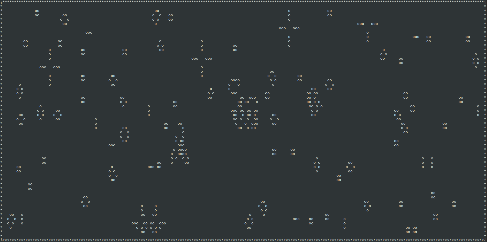

# A Curse(d) Life

### Conway's Game of Life
Simple thing I like to play once in a while. 

### build instructions

tested on Ubuntu Xenial 16.04.3 LTS

```bash
# dev deps
sudo apt-get install libncurses5 libncurses5-dev libncurses5-doc 

# build
make

# clean
make clean

# install (sudo)
make install 

```

### screenshot


### gameplay

* `c` clear world
* `f` fill world
* `r` reload world
* `p` pause
* `k` increment delay
* `j` decrement delay
* `MOUSE CLICK` toggle life at position
* `q` quit

### references
* [Cellular Automaton](https://en.wikipedia.org/wiki/Cellular_automaton)
* [Wikipedia](https://en.wikipedia.org/wiki/Conway%27s_Game_of_Life)
* [Glider](https://en.wikipedia.org/wiki/Glider_(Conway%27s_Life))

